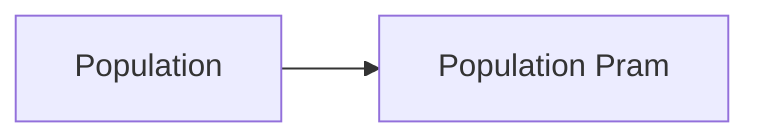
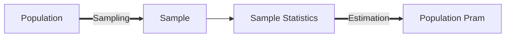

## Sampling and Estimation

### Sampling

#### 1. Types of data

* Time-series （横）
  * A sequence of return collected at discrete and **equally** spaced intervals of time
* Cross-sectional data （纵）
  * Data on some characteristic of individuals, groups, geographical regions, or companies at a **single point** in time

#### 2. Overview

We want:

We have:

