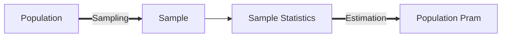

## Sampling and Estimation

### Sampling

#### 1. Types of data

* Time-series （横）
  * A sequence of return collected at discrete and **equally** spaced intervals of time
* Cross-sectional data （纵）
  * Data on some characteristic of individuals, groups, geographical regions, or companies at a **single point** in time

#### 2. Overview

We want:

We have（样本太大或者破坏性实验）:

#### 3. Selection of Sample Size

* Larger sample size would produce a better estimate or parameter (precision)
* But larger sample size may involve additional expenses that outweigh the value of additional precision
* Sampling from more than one population would not improve the estimate for the parameter (sampling risk) （抽的方法就错了，得从同一个Population里面抽）

#### 4. Sampling

* Simple random sampling
  * Each element of the population has an equal probability of being selected
* Stratified random sampling 
  * 先根据某种标准划分，每个标准抽同样的比例，分了n层，一共n+1类
* Sampling error is the difference between the sample statistic and the population parameter
* Sampling distribution 样本统计量（样本的均值方差之类的）的分布

#### 5. Sampling Biases

* Data-mining bias: 明明没有金融上或逻辑上的联系，不断做数据挖掘直到最终得到错误的仅仅统计学层面的结论 （比如哪个月份董事长出生的上市公司回报率最好）

* Sampling selection bias: 样本选错了
* Survivorship bias: 那些已经死掉的基金都没有统计
* Look-ahead bias: 构建模型的时候使用的的那一天之后发生的事情不能考虑到构建模型这件事上
* Time-period bias: 根据抽选的时间段不同会得出不同的结论

### Central Limit Theorem

#### 1. Estimator（样本统计量）

Estimator is a random variable that generates estimates of a parameter of a given distribution

* Unbiasedness （estimator的期望值和要估计的parameter一样）（最重要）
* Consistency （随着样本量size增加，估计的精度增加（方差降低））
* Efficiency （无偏估计量哪个方差最小哪个最有效，前提是无偏估计量）（有效一定无偏）

#### 2. 中心极限定理

A population described by any distribution,

having mean $\mu$ and **finite** variance $\sigma^2$

The sampling distribution of sample mean $\bar X$ computed from **simple random** samples of **same size** n from this population,

will be approximately normal with mean $\mu$ and variance $\frac {\sigma^2} n$ 

when the sample size n is large (>=30)